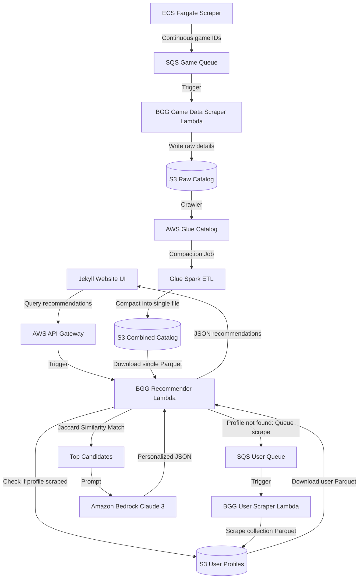

# Boardgame Recommender

     

An end-to-end cloud-native serverless system that scrapes board game catalogs and player collection data from the BoardGameGeek (BGG) API, aggregates it into an optimized S3 data lake, and generates personalized board game recommendations with AI-driven explanations.

---

## System Architecture

---

## Directory Structure

* **[site_ui/](file:///d:/Git/Boardgame-Recommender/site_ui)**: The frontend Jekyll dashboard, collection browser, and recommendation interface hosted on GitHub Pages.
* **[bgg_recommender/](file:///d:/Git/Boardgame-Recommender/bgg_recommender)**: Python container-based Lambda served via API Gateway. Extracts catalog & user collections from S3, executes Jaccard matching, and uses Bedrock Claude 3 Haiku for reasoning.
* **[bgg_game_scraper/](file:///d:/Git/Boardgame-Recommender/bgg_game_scraper)**: Continuous containerized python scraper (run in ECS Fargate) that discovers boardgame IDs and pushes them to SQS.
* **[bgg_game_data_scraper/](file:///d:/Git/Boardgame-Recommender/bgg_game_data_scraper)**: SQS-triggered Lambda scraper that downloads game details (mechanics, complexity, name, year) and writes them to raw S3 Parquet.
* **[bgg_user_data_scraper/](file:///d:/Git/Boardgame-Recommender/bgg_user_data_scraper)**: SQS-triggered Lambda scraper that downloads a BGG user's collection, rated games, and ownership status.
* **[bgg_raw_to_compressed/](file:///d:/Git/Boardgame-Recommender/bgg_raw_to_compressed)**: AWS Glue PySpark ETL scripts that compact thousands of raw JSON/Parquet catalog files into unified, consolidated S3 Parquet tables.
* **[infrastructure/](file:///d:/Git/Boardgame-Recommender/infrastructure)**: Core Terraform templates provisioning S3, Glue Catalogs, Crawlers, API Gateway routes, Lambda functions, IAM roles, and Glue workflows.
* **[ecr_infrastructure/](file:///d:/Git/Boardgame-Recommender/ecr_infrastructure)**: Terraform templates configuring ECR repositories and repository lifecycle rules.
* **[ml_engine/](file:///d:/Git/Boardgame-Recommender/ml_engine)**: Experimental LightFM collaborative filtering training script using PyAthena connection logic.

---

## GitHub Actions Workflows

All Docker containers and Terraform infrastructures are continuously deployed via GitHub Actions:
* **`jekyll-gh-pages.yml`**: Builds and deploys Jekyll website frontend to GitHub Pages.
* **`recommender-docker-image.yml`**: Builds and pushes `bgg_recommender` Lambda container image to Amazon ECR.
* **`scraper-docker-image.yml`**: Builds and pushes `bgg_game_scraper` ECS container image to Amazon ECR.
* **`data-scraper-docker-image.yml`**: Builds and pushes `bgg_game_data_scraper` Lambda container image to Amazon ECR.
* **`user-scraper-docker-image.yml`**: Builds and pushes `bgg_user_data_scraper` Lambda container image to Amazon ECR.
* **`terraform.yml`**: Continuous integration plan/apply execution for core infrastructure.
* **`ecr_terraform.yml`**: Plan/apply execution for ECR container repositories.
