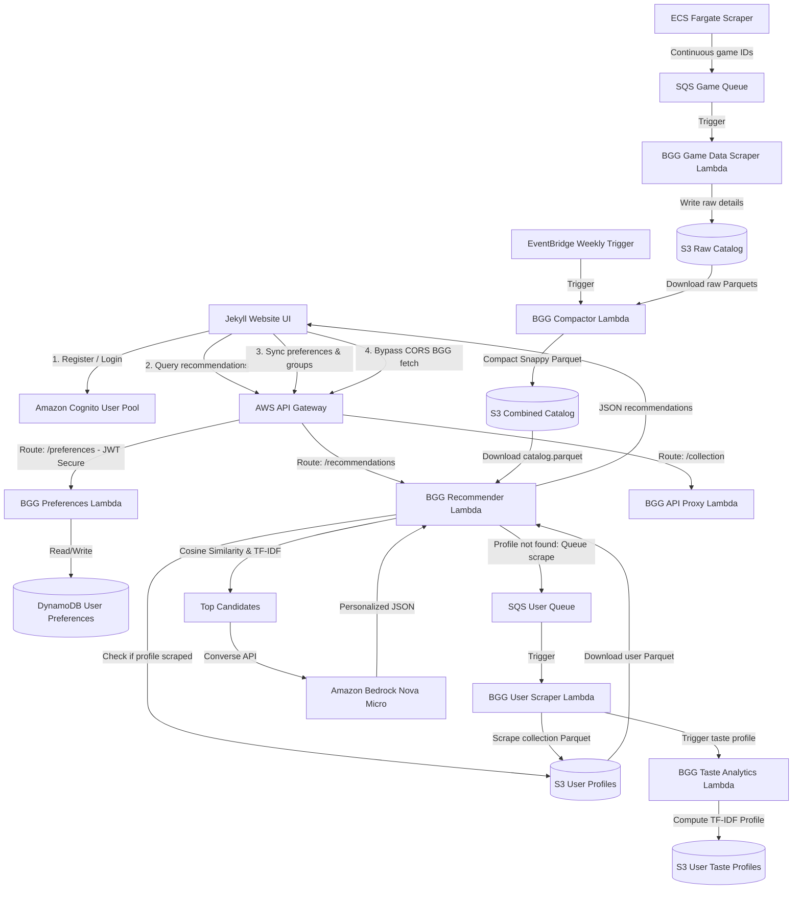

# Boardgame Recommender

     

An end-to-end cloud-native serverless system that scrapes board game catalogs and player collection data from the BoardGameGeek (BGG) XML API2, aggregates it into an optimized S3 data lake, and generates personalized board game recommendations with AI-driven explanations powered by Amazon Bedrock (Nova Micro).

---

## Documentation Hub

- 🏛️ **[System Architecture & High-Level Design](file:///d:/Git/Boardgame-Recommender/docs/ARCHITECTURE.md)**: Deep dive into the serverless architecture, data lake hierarchy, TF-IDF cosine scoring algorithms, and security model.
- 💻 **[Local Development Guide](file:///d:/Git/Boardgame-Recommender/LOCAL_DEVELOPMENT.md)**: Comprehensive instructions for running Jekyll locally, offline mock APIs, and running unit test suites.
- 🗺️ **[Core Project Roadmap](file:///d:/Git/Boardgame-Recommender/project_roadmap.md)**: Active and completed engineering milestones for the platform.
- 🍻 **[Cafe & Bar Edition Roadmap](file:///d:/Git/Boardgame-Recommender/cafe_roadmap.md)**: Dedicated roadmap for turnkey board game cafe onboarding and table recommendations.
- 📐 **[Cafe Edition Design Specification](file:///d:/Git/Boardgame-Recommender/docs/cafe_edition_design.md)**: Full architecture, self-service onboarding flow, and UI specs for board game cafe venues.

---

## System Architecture

```mermaid
graph TD
    Client[Jekyll Website UI] -->|1. Register / Login| Cognito[Amazon Cognito User Pool]
    Client -->|2. Query recommendations| APIGW[AWS API Gateway]
    Client -->|3. Sync preferences & groups| APIGW
    Client -->|4. Bypass CORS BGG fetch| APIGW
    
    APIGW -->|Route: /recommendations| ServingLambda[BGG Recommender Lambda]
    APIGW -->|Route: /preferences - JWT Secure| PreferencesLambda[BGG Preferences Lambda]
    APIGW -->|Route: /collection| ProxyLambda[BGG API Proxy Lambda]
    
    PreferencesLambda -->|Read/Write| DynamoDB[(DynamoDB User Preferences)]
    
    ServingLambda -->|Check if profile scraped| S3Users[(S3 User Profiles)]
    
    %% Scraper triggers
    ServingLambda -->|Profile not found: Queue scrape| SQSUser[SQS User Queue]
    SQSUser -->|Trigger| UserScraper[BGG User Scraper Lambda]
    UserScraper -->|Scrape collection Parquet| S3Users
    UserScraper -->|Trigger taste profile| TasteLambda[BGG Taste Analytics Lambda]
    TasteLambda -->|Compute TF-IDF Profile| S3Taste[(S3 User Taste Profiles)]
    
    %% Game Scraper Pipeline
    ECS[ECS Fargate Scraper] -->|Continuous game IDs| SQSGame[SQS Game Queue]
    SQSGame -->|Trigger| GameDataScraper[BGG Game Data Scraper Lambda]
    GameDataScraper -->|Write raw details| S3Raw[(S3 Raw Catalog)]
    
    %% Compaction
    EventBridge[EventBridge Weekly Trigger] -->|Trigger| CompactorLambda[BGG Compactor Lambda]
    S3Raw -->|Download raw Parquets| CompactorLambda
    CompactorLambda -->|Compact Snappy Parquet| S3Combined[(S3 Combined Catalog)]
    
    %% Recommendation retrieval
    S3Combined -->|Download catalog.parquet| ServingLambda
    S3Users -->|Download user Parquet| ServingLambda
    ServingLambda -->|Cosine Similarity & TF-IDF| Candidates[Top Candidates]
    Candidates -->|Converse API| Bedrock[Amazon Bedrock Nova Micro]
    Bedrock -->|Personalized JSON| ServingLambda
    ServingLambda -->|JSON recommendations| Client
```

---

## Component Overview

* **[site_ui/](file:///d:/Git/Boardgame-Recommender/site_ui)**: Mobile-first glassmorphic web dashboard, collection browser, recommendation interface, and table voting portal. See [site_ui/README.md](file:///d:/Git/Boardgame-Recommender/site_ui/README.md).
* **[bgg_recommender/](file:///d:/Git/Boardgame-Recommender/bgg_recommender)**: Containerized Lambda serving API. Executes candidate filtering, TF-IDF cosine similarity scoring, Bedrock reasoning, and table voting sessions. See [bgg_recommender/README.md](file:///d:/Git/Boardgame-Recommender/bgg_recommender/README.md).
* **[bgg_game_scraper/](file:///d:/Git/Boardgame-Recommender/bgg_game_scraper)**: Continuous Python crawler running on ECS Fargate that discovers catalog game IDs and pushes them to SQS. See [bgg_game_scraper/README.md](file:///d:/Git/Boardgame-Recommender/bgg_game_scraper/README.md).
* **[bgg_game_data_scraper/](file:///d:/Git/Boardgame-Recommender/bgg_game_data_scraper)**: SQS-triggered worker Lambda that downloads game details, mechanics, and player poll stats, outputting raw Parquet to S3. See [bgg_game_data_scraper/README.md](file:///d:/Git/Boardgame-Recommender/bgg_game_data_scraper/README.md).
* **[bgg_compactor/](file:///d:/Git/Boardgame-Recommender/bgg_compactor)**: Scheduled weekly Lambda that merges raw single-game Parquet files into a unified `catalog.parquet` table via PyArrow, bypassing expensive Glue crawlers. See [bgg_compactor/README.md](file:///d:/Git/Boardgame-Recommender/bgg_compactor/README.md).
* **[bgg_user_data_scraper/](file:///d:/Git/Boardgame-Recommender/bgg_user_data_scraper)**: SQS-triggered worker Lambda that downloads user collections and ratings with exponential backoff for BGG 202 status. See [bgg_user_data_scraper/README.md](file:///d:/Git/Boardgame-Recommender/bgg_user_data_scraper/README.md).
* **[bgg_taste_analytics/](file:///d:/Git/Boardgame-Recommender/bgg_taste_analytics)**: Asynchronous analytics worker Lambda calculating player taste vectors with catalog IDF discounting and rating-weighted mean complexity. See [bgg_taste_analytics/README.md](file:///d:/Git/Boardgame-Recommender/bgg_taste_analytics/README.md).
* **[bgg_preferences/](file:///d:/Git/Boardgame-Recommender/bgg_preferences)**: Secure Lambda API for storing user preferences, playgroups, and custom weight overrides in DynamoDB, validated via Cognito JWT. See [bgg_preferences/README.md](file:///d:/Git/Boardgame-Recommender/bgg_preferences/README.md).
* **[bgg_preview_refresh/](file:///d:/Git/Boardgame-Recommender/bgg_preview_refresh)**: Scheduled Lambda that discovers active convention previews (e.g. Spiel Essen, Gen Con) and generates game lists in S3. See [bgg_preview_refresh/README.md](file:///d:/Git/Boardgame-Recommender/bgg_preview_refresh/README.md).
* **[bgg_api_proxy/](file:///d:/Git/Boardgame-Recommender/bgg_api_proxy)**: Reverse proxy Lambda that forwards collection requests to BGG XML API2 to bypass browser CORS limitations. See [bgg_api_proxy/README.md](file:///d:/Git/Boardgame-Recommender/bgg_api_proxy/README.md).
* **[infrastructure/](file:///d:/Git/Boardgame-Recommender/infrastructure)**: Modular Terraform configurations provisioning Lambda, API Gateway, DynamoDB, S3, Cognito, EventBridge, and IAM roles. See [infrastructure/README.md](file:///d:/Git/Boardgame-Recommender/infrastructure/README.md).

---

## Continuous Deployment (CI/CD)

All Docker containers and Terraform configurations are continuously deployed via GitHub Actions:
* **`jekyll-gh-pages.yml`**: Builds and deploys Jekyll website frontend to GitHub Pages.
* **`recommender-docker-image.yml`**: Builds and pushes `bgg_recommender` Lambda container image to Amazon ECR.
* **`scraper-docker-image.yml`**: Builds and pushes `bgg_game_scraper` ECS container image to Amazon ECR.
* **`data-scraper-docker-image.yml`**: Builds and pushes `bgg_game_data_scraper` Lambda container image to Amazon ECR.
* **`user-scraper-docker-image.yml`**: Builds and pushes `bgg_user_data_scraper` Lambda container image to Amazon ECR.
* **`terraform.yml`**: Continuous integration plan/apply execution for core infrastructure.
