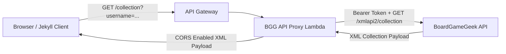

# BGG API Proxy Lambda

A lightweight, serverless reverse proxy Lambda deployed behind Amazon API Gateway that forwards client collection requests to the BoardGameGeek XML API2, eliminating browser Cross-Origin Resource Sharing (CORS) restrictions and securely injecting authorization tokens.

---

## Architecture Overview

---

## Key Responsibilities

1. **CORS Header Resolution:**
   - Web browsers enforce Cross-Origin Resource Sharing (CORS) policies that block direct client-side XML requests from custom domains (or GitHub Pages) to `boardgamegeek.com`.
   - The proxy returns standard `Access-Control-Allow-Origin: *` headers, allowing the client-side collection explorer to fetch XML payloads directly.
2. **Token Injection:**
   - Injects the `BGG_API_TOKEN` in the `Authorization` header when configured, keeping private credentials hidden from the client browser.
3. **Input Sanitization:**
   - Enforces strict regex validation (`^[a-zA-Z0-9_]{1,25}$`) on incoming usernames before dispatching remote HTTP calls.

---

## Environment Variables

| Variable | Description |
|---|---|
| `BGG_API_TOKEN` | Optional BoardGameGeek API Bearer Token for authenticated tier access |
