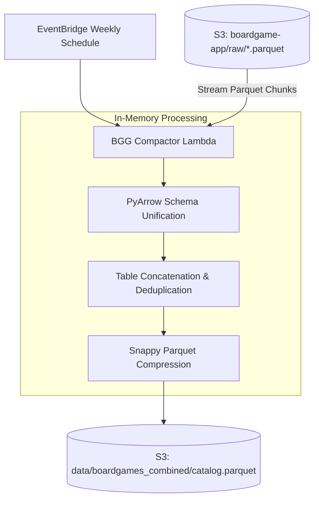

# BGG Catalog Compactor Lambda

A scheduled AWS Lambda pipeline that consolidates thousands of individual raw single-game Parquet files from S3 into a single, unified, Snappy-compressed `catalog.parquet` table.

---

## Architecture Overview



---

## Why In-Memory Lambda Compaction?

Traditional cloud data lake architectures rely on AWS Glue Crawlers and AWS Athena/EMR jobs for file compaction. For our ~140,000 game catalog, this approach was deliberately avoided:
- **Cost Reduction:** AWS Glue crawlers incur hourly minimum charges ($0.44/DPU-hour) regardless of file size. Our PyArrow Lambda runs in $\sim 15$ seconds, costing less than $\$0.001$ per compaction run.
- **Instant Schema Consistency:** PyArrow explicitly unifies field types (e.g. converting mixed integer/null year representations to nullable `int64`) during concatenation, avoiding Glue catalog type mismatch errors.
- **Zero Cold Start for Recommender:** The serving Lambda (`bgg_recommender`) downloads a single, monolithic, Snappy-compressed file rather than executing thousands of S3 GET requests.

---

## Execution Workflow (`combine_raw_to_single_file.py`)

1. **Discovery:** Scans `s3://{bucket}/raw/` for all `.parquet` keys.
2. **Streaming Batch Read:** Streams files in memory, casting columns into a strict, unified PyArrow schema.
3. **Deduplication:** Drops duplicate game IDs, retaining the most recent record.
4. **Snappy Compression:** Writes the unified PyArrow Table to a temporary local file with `compression='snappy'`.
5. **Upload:** Atomically overwrites `s3://{bucket}/data/boardgames_combined/catalog.parquet`.
6. **Cleanup:** Removes processed raw parquet files from the `raw/` prefix to keep S3 storage clean and idempotent.

---

## Environment Variables

| Variable | Description | Default |
|---|---|---|
| `S3_OUTPUT_BUCKET_NAME` | S3 bucket containing raw and combined catalogs | `boardgame-app` |
| `DELETE_SOURCE_FILES` | Boolean indicating whether to purge raw files after merge | `false` |

---

## Local Development & Testing

Run unit tests for schema alignment and compaction:
```bash
pytest tests/test_combine_raw_to_single_file.py -v
```
