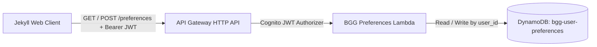

# BGG Preferences Lambda

A secure AWS Lambda API handler that manages user-specific settings, playgroups, and custom scoring weights in Amazon DynamoDB, secured via Amazon Cognito JWT claims validation.

---

## Architecture Overview



---

## API Endpoints

### 1. `GET /preferences`
- **Authentication:** Required (`Authorization: Bearer <Cognito_JWT>`).
- **Response:**
  ```json
  {
    "user_id": "us-east-1:a1b2c3d4-e5f6-7890",
    "bgg_username": "boardgamer123",
    "custom_weights": {
      "w_mech": 0.60,
      "w_cat": 0.40,
      "w_pop": 0.20,
      "w_comp": 0.35,
      "w_des": 0.35,
      "w_pub": 0.10
    },
    "playgroups": [
      {
        "group_id": "grp_friday_gamers",
        "name": "Friday Game Night",
        "members": ["boardgamer123", "meeple_queen", "dice_roller"]
      }
    ],
    "updated_at": "2026-10-05T12:00:00Z"
  }
  ```

### 2. `POST /preferences`
- **Authentication:** Required (`Authorization: Bearer <Cognito_JWT>`).
- **Payload:** Accepts updated `bgg_username`, `custom_weights`, and `playgroups`.
- **Validation:** Clamps weight values to valid numeric bounds ($0.0 - 1.0$) and validates usernames.

---

## Security & Multi-Tenancy

- **Claims Extraction:** The user ID is strictly extracted from `claims['sub']` in the validated request context.
- **Tenant Isolation:** A user can never read or overwrite another user's preference record.

---

## Environment Variables

| Variable | Description | Default |
|---|---|---|
| `DYNAMODB_TABLE_NAME` | DynamoDB table name for user preferences | `bgg-user-preferences` |

---

## Local Development & Testing

Run unit tests:
```bash
pytest tests/test_bgg_preferences.py -v
```
