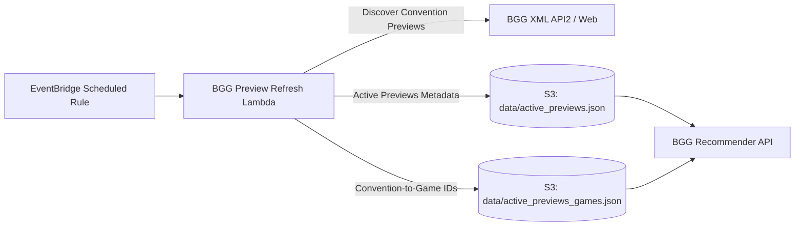

# BGG Preview Refresh Lambda

An automated scheduled AWS Lambda function that discovers upcoming and active tabletop board game conventions (such as Gen Con, Essen Spiel, and Origins Game Fair) from BoardGameGeek and refreshes convention preview game lists in S3.

---

## Architecture Overview



---

## Output Datasets

1. **`data/active_previews.json`:**
   Metadata for currently running or upcoming conventions within the active window:
   ```json
   [
     {
       "convention_id": "essen_spiel_2026",
       "name": "SPIEL Essen 2026 Previews",
       "date": "2026-10-22",
       "game_count": 842
     }
   ]
   ```

2. **`data/active_previews_games.json`:**
   Lookup mapping mapping `convention_id` to an array of valid BGG game IDs:
   ```json
   {
     "essen_spiel_2026": ["366013", "342942", "266192"]
   }
   ```

---

## Recommender Integration

The [`bgg_recommender`](file:///d:/Git/Boardgame-Recommender/bgg_recommender) reads these datasets to support convention-scoped recommendations:
- `GET /conventions`: Returns active convention options for client dropdowns.
- `GET /recommendations?convention_id=essen_spiel_2026`: Restricts candidate game selection exclusively to titles featured at the selected convention.

---

## Environment Variables

| Variable | Description | Default |
|---|---|---|
| `S3_BUCKET_NAME` | S3 data lake bucket name | `boardgame-app` |
