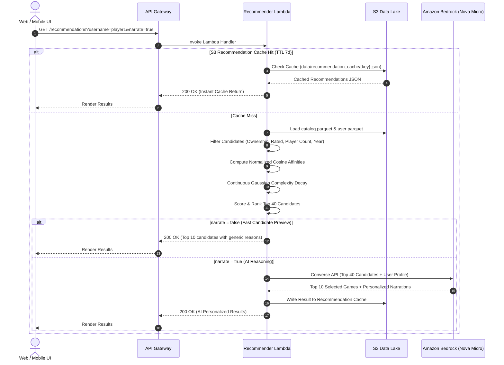

# Boardgame Recommender: System Architecture & High-Level Design

This document serves as the primary technical reference for the architecture, data pipelines, recommendation algorithms, storage hierarchy, and cloud infrastructure of the **Boardgame Recommender** platform.

---

## 1. System Overview

The Boardgame Recommender is an enterprise-grade, cloud-native serverless platform that indexes the global tabletop game catalog from the BoardGameGeek (BGG) XML API2, continuously maintains an optimized columnar data lake in Amazon S3, computes multi-dimensional player taste profiles, and serves AI-explained recommendations via Amazon Bedrock (Nova Micro).

### High-Level Architecture Diagram

```mermaid
graph TD
    subgraph Client Layer
        Web[Jekyll Glassmorphic UI<br/>GitHub Pages / S3 / CloudFront]
        Cognito[Amazon Cognito User Pool]
        Web -->|1. Authenticate / JWT| Cognito
    end

    subgraph API & Serving Layer
        APIGW[Amazon API Gateway HTTP API]
        RecLambda[BGG Recommender Lambda<br/>Container Image in ECR]
        PrefLambda[BGG Preferences Lambda<br/>Python 3.12]
        ProxyLambda[BGG API Proxy Lambda<br/>CORS & Token Injection]
        
        Web -->|2. Scored Recs / Profile / Sessions / Cafe Recs| APIGW
        Web -->|3. Read/Write Preferences & Cafe Management| APIGW
        Web -->|4. Bypass CORS BGG XML Fetch| APIGW
        
        APIGW -->|Route: /recommendations, /profile, /sessions, /cafe/vote/start| RecLambda
        APIGW -->|Route: /preferences, /cafe/* - Public & JWT Auth| PrefLambda
        APIGW -->|Route: /collection - Public| ProxyLambda
    end

    subgraph User Ingestion & Taste Analytics
        SQSUser[SQS User Queue]
        UserScraper[BGG User Data Scraper Lambda]
        TasteLambda[BGG Taste Analytics Lambda]
        
        RecLambda -->|Profile not found: Queue scrape| SQSUser
        SQSUser -->|Batch Trigger| UserScraper
        UserScraper -->|Scrape collection Parquet| S3Users[(S3: data/users/{username}.parquet)]
        UserScraper -->|Trigger taste profile| TasteLambda
        TasteLambda -->|Compute TF-IDF Profile| S3Taste[(S3: data/users/{username}_taste_profile.json)]
    end

    subgraph Catalog Discovery & Ingestion Pipeline
        ECS[ECS Fargate Scraper Task]
        SQSGame[SQS Game Queue]
        GameDataScraper[BGG Game Data Scraper Lambda]
        CompactorLambda[BGG Compactor Lambda]
        EventBridge[EventBridge Weekly Trigger]
        
        ECS -->|Continuous game ID discovery| SQSGame
        SQSGame -->|Batch 20 IDs| GameDataScraper
        GameDataScraper -->|Write raw details| S3Raw[(S3: raw/{game_id}.parquet)]
        EventBridge -->|Weekly Schedule| CompactorLambda
        S3Raw -->|PyArrow Merge & Snappy Compress| CompactorLambda
        CompactorLambda -->|Output unified catalog| S3Catalog[(S3: data/boardgames_combined/catalog.parquet)]
    end

    subgraph Persistence & Reasoning
        DDBPref[(DynamoDB: bgg-user-preferences)]
        DDBCafe[(DynamoDB: bgg-cafes)]
        DDBSess[(DynamoDB: bgg-game-night-sessions)]
        Bedrock[Amazon Bedrock<br/>Nova Micro LLM]
        
        PrefLambda <-->|User settings & playgroups| DDBPref
        PrefLambda <-->|Venue registry & settings| DDBCafe
        RecLambda <-->|Session voting & veto consensus| DDBSess
        RecLambda -->|Top 40 Candidates| Bedrock
        Bedrock -->|Top 10 Selection & Personalized Reasons| RecLambda
    end
```

---

## 2. Component Directory Map

| Directory | Type | Runtime / Service | Responsibility |
|---|---|---|---|
| [**`site_ui/`**](file:///d:/Git/Boardgame-Recommender/site_ui) | Web UI | Jekyll, Vanilla CSS, JS | Mobile-first glassmorphic web dashboard, modular page scripts (`groups.js`, `collection.js`, `recommender.js`), stylesheets, and table voting portal. |
| [**`bgg_recommender/`**](file:///d:/Git/Boardgame-Recommender/bgg_recommender) | Serving API | AWS Lambda (Container) | Core recommendation engine, candidate filtering, TF-IDF inline scoring, Bedrock Nova Micro grounding, and table session handlers (`session_handlers.py`). |

| [**`bgg_game_scraper/`**](file:///d:/Git/Boardgame-Recommender/bgg_game_scraper) | Scraper | AWS ECS Fargate | Continuous crawler that discovers game IDs across BGG and enqueues batches to SQS. |
| [**`bgg_game_data_scraper/`**](file:///d:/Git/Boardgame-Recommender/bgg_game_data_scraper) | Scraper Worker | AWS Lambda (Container) | SQS-triggered worker that fetches XML details for up to 20 game IDs per batch and saves raw Parquet files to S3. |
| [**`bgg_compactor/`**](file:///d:/Git/Boardgame-Recommender/bgg_compactor) | Data Pipeline | AWS Lambda (Container) | Merges thousands of single-game Parquet files into a unified `catalog.parquet` table, bypassing costly Glue crawlers. |
| [**`bgg_user_data_scraper/`**](file:///d:/Git/Boardgame-Recommender/bgg_user_data_scraper) | Scraper Worker | AWS Lambda (Container) | SQS-triggered worker that queries a BGG user's collection, rated games, and ownership status with exponential backoff for BGG 202 status. |
| [**`bgg_taste_analytics/`**](file:///d:/Git/Boardgame-Recommender/bgg_taste_analytics) | Analytics Worker | AWS Lambda (Python 3.12) | Computes TF-IDF preference vectors with catalog-wide document frequency discounting ($\ln(1 + N/N_f)$) and user mean complexity. |
| [**`bgg_preferences/`**](file:///d:/Git/Boardgame-Recommender/bgg_preferences) | Auth API | AWS Lambda (Python 3.12) | Manages user custom scoring weights, playgroups, and saved settings in DynamoDB, secured by Cognito JWT. |
| [**`bgg_api_proxy/`**](file:///d:/Git/Boardgame-Recommender/bgg_api_proxy) | Network Proxy | AWS Lambda (Python 3.12) | Proxies frontend requests to the BGG XML API2 `/collection` endpoint to bypass browser CORS constraints. |
| [**`bgg_preview_refresh/`**](file:///d:/Git/Boardgame-Recommender/bgg_preview_refresh) | Cron Task | AWS Lambda (Python 3.12) | Discovers active tabletop conventions (Gen Con, Essen Spiel) and generates convention game lists in S3. |
| [**`infrastructure/`**](file:///d:/Git/Boardgame-Recommender/infrastructure) | IaC | HashiCorp Terraform | Modular infrastructure-as-code definitions for Lambda, API Gateway, DynamoDB, S3, Cognito, EventBridge, and IAM. |

---

## 3. Data Architecture & Storage Layout

### S3 Data Lake Hierarchy (`s3://boardgame-app/`)

```text
boardgame-app/
├── raw/                                      # Single-game raw Parquet files
│   ├── 1.parquet
│   ├── 13.parquet
│   └── {game_id}.parquet
├── data/
│   ├── boardgames_combined/
│   │   └── catalog.parquet                   # Master compacted Snappy Parquet (~140k titles)
│   ├── catalog_feature_frequencies.json      # Precalculated catalog document frequencies for IDF
│   ├── users/
│   │   ├── {username}.parquet                # User's rated & owned game collection
│   │   └── {username}_taste_profile.json     # Precomputed TF-IDF affinity weights
│   ├── recommendation_cache/                 # Scored recommendation JSON caches (TTL: 7 days)
│   │   └── {cache_key}.json
│   ├── active_previews.json                  # Active convention metadata
│   ├── active_previews_games.json            # Convention-to-game ID mappings
│   └── cafes/                                # Cafe / Bar Edition inventories & metadata
│       └── {cafe_id}/
│           ├── collection.parquet
│           ├── meta.json
│           └── overrides.json
```

### Primary Schemas

#### 1. Catalog Parquet Schema (`catalog.parquet`)
| Column | Type | Description |
|---|---|---|
| `id` | `string` | Unique BGG game identifier. |
| `name` | `string` | Primary English game title. |
| `year_published` | `int64` | Initial release year. |
| `min_players` / `max_players` | `int64` | Official player count bounds. |
| `playing_time` / `min_playtime` / `max_playtime` | `int64` | Playtime duration in minutes. |
| `min_age` | `int64` | Minimum recommended player age. |
| `rating` | `float64` | BGG Bayes Average rating (Geek Rating, $1.0 - 10.0$). |
| `complexity` | `float64` | Average community weight / complexity rating ($1.0 - 5.0$). |
| `thumbnail` / `image` | `string` | CDN URLs for box art. |
| `categories` | `list<string>` | BGG board game categories (e.g. `Economic`, `Card Game`). |
| `mechanics` | `list<string>` | BGG mechanics (e.g. `Hand Management`, `Worker Placement`). |
| `designers` / `publishers` | `list<string>` | Credited game designers and publishing houses. |
| `suggested_players_best` | `list<string>` | Community poll results for optimal player counts. |
| `suggested_players_recommended`| `list<string>` | Community poll results for viable player counts. |

#### 2. User Collection Parquet Schema (`data/users/{username}.parquet`)
| Column | Type | Description |
|---|---|---|
| `id` | `string` | BGG game identifier. |
| `username` | `string` | Target BGG username. |
| `rating` | `float64` | User's personal rating ($1.0 - 10.0$, nullable). |
| `own` | `bool` | True if marked as owned in BGG collection. |
| `want_to_play` / `want_to_buy` | `bool` | BGG wishlist / interest flags. |

#### 3. User Preferences DynamoDB Table (`bgg-user-preferences`)
- **Partition Key (`PK`):** `user_id` (Cognito `sub` UUID)
- **Attributes:**
  - `bgg_username`: Linked BGG handle.
  - `custom_weights`: Dictionary of user weight overrides (`w_mech`, `w_cat`, `w_pop`, `w_comp`, `w_des`, `w_pub`).
  - `playgroups`: List of saved group objects `{group_id, name, members: [username1, username2]}`.
  - `updated_at`: ISO8601 timestamp.

#### 4. Game Night Sessions DynamoDB Table (`bgg-game-night-sessions`)
- **Partition Key (`PK`):** `session_id` (6-character alphanumeric code)
- **Global Secondary Index:** `creator_id`
- **TTL Attribute:** `expires_at` (Epoch timestamp, 24–72 hour retention)
- **Attributes:**
  - `creator_name`, `group_name`, `created_at`, `status` (`voting` | `closed`).
  - `candidates`: List of 3–5 candidate games with thumbnail and metadata.
  - `votes`: Map of `{ participant_name: { game_id: score } }` where score is $+2$ (Favorite), $+1$ (Interested), or $-99$ (Veto).

#### 5. Cafe Venue Registry DynamoDB Table (`bgg-cafes`)
- **Partition Key (`PK`):** `cafe_id` (vanity slug string)
- **Global Secondary Index:** `owner_cognito_id-index` (Partition Key: `owner_cognito_id`)
- **Attributes:**
  - `name`, `bgg_username`, `slug`, `table_count`, `wifi_ssid`, `wifi_password`, `tagline`, `shelf_regex`, `drink_pairings_enabled`, `logo_url`, `created_at`, `updated_at`, `last_sync_timestamp`.

#### 6. Cafe Inventory Parquet Schema (`data/cafes/{cafe_id}/collection.parquet`)
| Column | Type | Description |
|---|---|---|
| `id` | `string` | BGG game identifier. |
| `name` | `string` | Primary game title. |
| `thumbnail` | `string` | Box art thumbnail URL. |
| `year_published` | `int64` | Initial release year. |
| `min_players` / `max_players` | `int64` | Player count boundaries. |
| `playing_time` | `int64` | Playing duration in minutes. |
| `rating` | `float64` | Average BGG rating. |
| `complexity` | `float64` | Weight / complexity score ($1.0 - 5.0$). |
| `own` | `bool` | True if owned by venue. |
| `shelf_location` | `string` | Physical location parsed from comments (e.g. `Shelf B-3`). |

---

## 4. Recommendation Scoring & Reasoning Pipeline

The recommendation engine in [`bgg_recommender/`](file:///d:/Git/Boardgame-Recommender/bgg_recommender) executes in two coordinated phases to minimize latency and AWS Bedrock invocation costs:



### Recommendation Math & Affinity Formula

1. **Tag Affinity (TF-IDF & Cosine Similarity):**
   Affinity between candidate games and player taste vectors utilizes true cosine similarity, normalizing the dot product by the candidate's tag count vector norm to eliminate popularity bias toward games with dozens of tags:
   $$\text{Sim}_{\text{mech}}(g, u) = \frac{\sum_{m \in g.\text{mechs}} w_m^{(u)}}{\sqrt{|g.\text{mechs}|}}$$

2. **Complexity Distance Decay:**
   Rather than hard bucket filtering, complexity matching employs continuous Gaussian distance decay centered on the user's rating-weighted mean complexity $\mu_{\text{comp}}$:
   $$\text{Score}_{\text{comp}}(g, u) = \exp\left( - \frac{(g.\text{complexity} - \mu_{\text{comp}})^2}{2 \sigma^2} \right), \quad \sigma = 0.75$$

3. **Composite Scoring Function:**
   $$\text{Score}(g, u) = w_{\text{mech}} \cdot \text{Sim}_{\text{mech}} + w_{\text{cat}} \cdot \text{Sim}_{\text{cat}} + w_{\text{comp}} \cdot \text{Score}_{\text{comp}} + w_{\text{des}} \cdot \text{Sim}_{\text{des}} + w_{\text{pub}} \cdot \text{Sim}_{\text{pub}} + w_{\text{pop}} \cdot g.\text{bayes\_rating} + w_{\text{hot}} \cdot g.\text{hotness}$$

---

## 5. Security & Authentication Architecture

- **Public Endpoints (Anonymous / Ephemeral):**
  - `GET /recommendations`: Accessible without credentials; allows cold-start quiz inputs, BGG handle querying, and cafe sommelier table recommendations (`?cafe_id=...&vibe=...`).
  - `GET /collection`: Proxied BGG collection queries to bypass browser CORS.
  - `GET /vote/:session_id` & `POST /vote/:session_id`: Ephemeral table voting using client participant names.
  - `POST /cafe/vote/start`: Single-tap cafe table voting session instantiation.
  - `GET /cafe/validate-bgg`, `GET /cafe/check-slug`, `GET /cafe/meta`, `GET /cafe/collection`: Public venue metadata and collection serving.
- **Secured Endpoints (Amazon Cognito JWT):**
  - `GET /preferences` & `POST /preferences`: Protected by API Gateway HTTP API Cognito Authorizer.
  - `POST /cafe/onboard`: Venue onboarding persisting owner Cognito `sub` claims.
  - `POST /cafe/sync`, `GET /cafe/my-cafes`, `POST /cafe/update`: Verified against `owner_cognito_id` in `bgg-cafes` DynamoDB.
  - Claims Extraction: Handlers extract `sub` directly from verified claims, guaranteeing users cannot read or modify another user's preferences or venues.
- **Account Recovery & Identity Management:**
  - Client-side Cognito self-service password recovery via `ForgotPassword` and `ConfirmForgotPassword` APIs in [utils.js](file:///d:/Git/Boardgame-Recommender/site_ui/assets/js/utils.js).
  - Multi-step modal views with verification code delivery via SES custom HTML templates and real-time password complexity validation.
- **Rate Limiting & Throttling:**

  - API Gateway stages enforce default throttling rate limits (`5 req/sec`, burst `10`) to prevent runaway costs from scraping attacks or recursive loops.

---

## 6. Cost Control & Operational Guardrails

This architecture adheres to strict serverless budget guardrails:
1. **Zero Standing Idle Cost:** Lambdas scale to 0; DynamoDB uses Pay-Per-Request (On-Demand) billing; S3 stores static artifacts with lifecycle expiration rules.
2. **Glue / Athena Avoidance:** Data compaction and schema merging run in a memory-optimized Lambda using PyArrow in $<15\text{s}$, completely avoiding AWS Glue crawler hourly minimum charges and Athena per-query costs.
3. **Bedrock Optimization:** Bedrock is invoked only for the final top 40 candidates rather than the full 140k catalog, utilizing Amazon Nova Micro for high throughput and low token costs.
4. **Aggressive Cache Invalidation Strategy:** S3 caches both BGG profile metadata and finished recommendation payloads with a 7-day TTL, preventing redundant model invocations.
