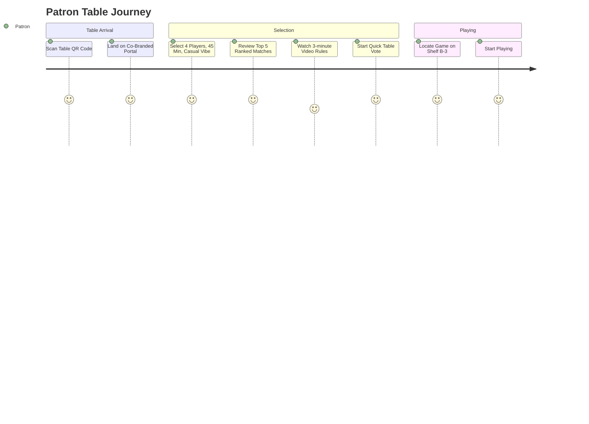
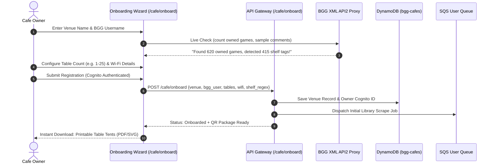

# Board Game Cafe & Bar Edition: Architecture & Design Specification

This document provides the comprehensive system architecture, data models, API contracts, UX workflows, and operational design to adapt the **Boardgame Recommender** platform into a turnkey solution for board game cafes, bars, and lounges.

---

## 1. Executive Summary & Vision

Board game cafes and bars face a universal problem: **"Game Selection Paralysis."**
Patrons sit down with drinks and a menu of 400–1,500+ board games on cafe shelves. Staff spend up to 20 minutes per table recommending games, only for patrons to pick a game with a 45-minute rules explanation that ends up unplayed.

The **Cafe & Bar Edition** turns any venue's BGG-cataloged library into an interactive, mobile-first digital sommelier:
- **Instant Table Access:** Patrons scan a table QR code (`/cafe/the-dice-box?table=4`).
- **Zero Friction (No BGG Login Required):** A 30-second "Table Vibe Check" triages player count, available time, and mood.
- **Strict Shelf Scoping:** Recommendations are strictly restricted to games currently in stock at the venue.
- **Physical Shelf Guidance:** Cards display exact shelf locations (e.g. *"Shelf B-3"*), rules teach duration, and 1-tap "Watch It Played" videos.
- **Table Voting:** Friends at the table vote in real-time on the top candidates to pick a winner in under 60 seconds.

---

## 2. Personas & Core User Journeys



### Persona 1: The Casual Patron (80%+ of Cafe Traffic)
- **Profile:** 2–6 friends having beers or coffee; only knows *Catan*, *Ticket to Ride*, or party games.
- **Pain Point:** Intimidated by the wall of games; doesn't know what will fit their group size and time.
- **Journey:** Scans QR $\rightarrow$ 3-tap quiz $\rightarrow$ sees 3 clear, non-intimidating options with 3-minute video links and shelf location.

### Persona 2: The Table of Hobbyists
- **Profile:** Experienced gamers visiting a cafe to try games before buying.
- **Pain Point:** Want to filter the cafe's library specifically for games that match their taste or games they haven't played yet.
- **Journey:** Scans QR $\rightarrow$ enters their BGG usernames $\rightarrow$ gets personalized recommendations from the cafe shelf.

### Persona 3: Cafe Floor Staff / Game Guru
- **Profile:** Busy server/game sommelier managing 15 tables on a Friday night.
- **Pain Point:** Spends excessive time answering "What should we play?" instead of serving orders or teaching rules.
- **Journey:** Points patrons directly to the table QR code for self-service game recommendations, rules videos, and table voting.

### Persona 4: Cafe Owner / General Manager
- **Profile:** Manages library investments, floor operations, and table turnover.
- **Pain Point:** Cannot afford expensive custom app development; wants a zero-friction way to onboard their venue in under 5 minutes without engineering support.
- **Journey:** Visits `/cafe/onboard` $\rightarrow$ enters their BGG username $\rightarrow$ tests shelf location detection $\rightarrow$ receives instant table QR code PDFs $\rightarrow$ views table analytics.

---

## 3. End-to-End System Architecture

```mermaid
graph TD
    subgraph Self-Service Onboarding & Registry
        Owner[Cafe Owner / Manager] -->|1. Sign Up & Input BGG Info| OnboardUI[Onboarding Portal<br/>site_ui/cafe/onboard.html]
        OnboardUI -->|2. Verify BGG Collection & Shelf Tags| APIGW[API Gateway]
        APIGW -->|Route: POST /cafe/onboard| PrefLambda[BGG Preferences / Cafe Lambda]
        PrefLambda -->|3. Store Venue Metadata| CafeDDB[(DynamoDB: bgg-cafes)]
        PrefLambda -->|4. Queue Initial Collection Scrape| SQSUser[SQS User Queue]
        SQSUser -->|5. Ingest BGG Library Parquet| Scraper[User Data Scraper Lambda]
        Scraper -->|Write catalog + shelf notes| S3Cafe[S3: data/cafes/{cafe_id}/collection.parquet]
        PrefLambda -->|6. Generate Instant QR Package| QRGen[Printable QR Table Tents]
    end

    subgraph Table Serving & Recommendation Engine
        Patron[Table Patron] -->|Scan QR /cafe/{cafe_id}?table=X| APIGW
        APIGW -->|Route: GET /recommendations?cafe_id=...| RecLambda[BGG Recommender Lambda]
        Catalog[S3: catalog.parquet] --> RecLambda
        S3Cafe -->|Scoped Candidate Mask| RecLambda
        RecLambda --> Bedrock[Amazon Bedrock Nova Micro<br/>Sommelier Persona]
        Bedrock --> Results[Ranked Recommendations JSON]
        Results --> Patron
    end

    subgraph Interactive Features
        Patron -->|Create / Cast Vote| Sessions[Table Sessions API<br/>bgg-game-night-sessions DynamoDB]
    end
```

---

## 4. Self-Service Cafe Onboarding Workflow

The onboarding experience is designed to take **under 3 minutes** from arrival to printing table tents:



### 4.1 Onboarding Wizard Steps (`site_ui/cafe/onboard.html`)

1. **Step 1: Venue Identity & BGG Account**
   - Venue Name (e.g., *"The Malt & Meeple"*).
   - Preferred URL slug (e.g., `malt-and-meeple`, validated for uniqueness).
   - BGG Username (e.g., `maltandmeeple`).
   - Real-time "Verify BGG Collection" button: Calls `GET /cafe/validate-bgg?username=maltandmeeple`.
     - Displays live preview: *"✅ 642 games found marked as 'Owned'"*.
     - Sample shelf comment preview: *"Sample detected: 'Shelf B-2' $\rightarrow$ Location: B-2"*.

2. **Step 2: Table Setup & Venue Amenities**
   - Number of Tables (e.g., 20 tables $\rightarrow$ automatically prepares Table 1 through 20).
   - Guest Wi-Fi Network & Password (printed directly on patron table tents to reduce staff questions).
   - Custom Tagline / Welcome Message (e.g., *"Welcome! 20 craft taps on draft. Ask staff for game recommendations."*).
   - Drink Pairings Toggle: Allows staff to recommend house drinks next to games.

3. **Step 3: Instant Launch & QR Kit**
   - 1-click download of the complete **Printable QR Table Tent Kit** (vector PDF with foldable table tents, QR codes, and table badges).
   - Immediate access to:
     - Patron Table URL: `https://recommender.domain.com/cafe/malt-and-meeple?table=1`
     - Owner Management Dashboard: `https://recommender.domain.com/cafe/malt-and-meeple/admin`

---

## 5. Component Technical Specifications

### 5.1 Venue Data Model (Amazon DynamoDB: `bgg-cafes`)

Venues are stored in DynamoDB for fast self-service updates and owner management:

- **Partition Key (`PK`):** `cafe_id` (String, e.g. `the-dice-box`)
- **Global Secondary Index (`GSI_Owner`):** `owner_cognito_id` (String) $\rightarrow$ enables owners to manage multiple venues.
- **Attributes:**
  ```json
  {
    "cafe_id": "the-dice-box",
    "owner_cognito_id": "us-east-1:a1b2c3d4-e5f6-7890",
    "name": "The Dice Box Cafe & Bar",
    "bgg_username": "diceboxcafe",
    "slug": "the-dice-box",
    "logo_url": "https://assets.dicebox.com/logo.png",
    "tagline": "Craft beer & 800+ tabletop games in downtown.",
    "wifi_ssid": "DiceBox-Guest",
    "wifi_password": "rollinitiative",
    "table_count": 25,
    "shelf_regex": "(?:Shelf|Location|Bin):?\\s*([A-Za-z0-9\\-]+)",
    "drink_pairings_enabled": true,
    "featured_game_ids": ["266192", "342942"],
    "staff_pin": "4321",
    "last_sync_timestamp": "2026-10-05T12:00:00Z",
    "created_at": "2026-10-05T00:00:00Z"
  }
  ```

#### S3 Metadata Mirror
Upon registration or update, DynamoDB triggers a write to `s3://boardgame-app/data/cafes/{cafe_id}/meta.json` and updates `data/cafes_registry.json` so recommendation serving Lambdas can read cached venue settings from memory/S3 without incur DynamoDB read costs on every table scan.

### 5.2 Catalog Management: Single-Source BGG Ingestion & On-Demand Sync

Venues manage their physical game inventory using BoardGameGeek as the single authoritative source of truth:

```mermaid
graph TD
    BGG[BGG Account: own=1 + Shelf Comments] -->|Scheduled Weekly or On-Demand POST /cafe/sync| Scraper[User Data Scraper Lambda]
    Scraper -->|Extract catalog, player limits, weight & shelf regex| FinalParquet[S3: data/cafes/{cafe_id}/collection.parquet]
    FinalParquet --> Recommender[Recommendation Engine]
    Manager[Cafe Owner / Manager] -->|Trigger On-Demand Sync| SyncAPI[POST /cafe/sync]
    SyncAPI --> Scraper
```

#### On-Demand BGG Sync ("Refresh from BGG")
Whenever cafe staff finishes adding or updating games on their BGG account:
- Staff clicks **"🔄 Sync Library from BGG"** in their management portal.
- API: `POST /cafe/sync` (Cognito protected).
- Re-runs the BGG scraper, parses new titles, extracts shelf locations from collection comments (`Shelf: B-3`), generates `collection.parquet`, and clears the cafe's recommendation cache.
- The portal displays a real-time progress banner with the last-synced timestamp.

---

### 5.3 Recommender Scoping Engine ([`bgg_recommender.py`](file:///d:/Git/Boardgame-Recommender/bgg_recommender/bgg_recommender.py))

#### Route Parameters
`GET /recommendations?cafe_id=the-dice-box&player_count=4&duration_pref=medium&vibe=casual_strategy&table=12`

#### Candidate Scoping Logic
```python
def filter_cafe_candidates(candidates_df, cafe_id, s3_client, bucket_name):
    """Restricts candidate pool strictly to the cafe's available inventory."""
    cafe_parquet_key = f"data/cafes/{cafe_id}/collection.parquet"
    local_path = f"/tmp/{cafe_id}_collection.parquet"
    
    s3_client.download_file(bucket_name, cafe_parquet_key, local_path)
    cafe_inventory_df = pd.read_parquet(local_path)
    
    # Filter out games marked out of stock or checked out
    if 'in_stock' in cafe_inventory_df.columns:
        cafe_inventory_df = cafe_inventory_df[cafe_inventory_df['in_stock'] == True]
        
    cafe_game_ids = set(cafe_inventory_df['id'].astype(str))
    scoped_candidates = candidates_df[candidates_df['id'].astype(str).isin(cafe_game_ids)]
    
    # Merge shelf location and cafe custom notes into candidate records
    scoped_candidates = scoped_candidates.merge(
        cafe_inventory_df[['id', 'shelf_location', 'drink_pairing']], 
        on='id', 
        how='left'
    )
    return scoped_candidates
```

---

### 4.3 The 30-Second Table Vibe Vector Engine

For patrons without a BGG account, the UI passes a `vibe` parameter. The backend converts this into synthetic weight profiles without calling Bedrock for candidate generation:

| Vibe Preset | Target Complexity ($\mu, \sigma$) | Weight Biases | Target Mechanics / Categories |
|---|---|---|---|
| **🍻 Party & Social** | $\mu = 1.3, \sigma = 0.4$ | `w_comp=0.5, w_pop=0.4, w_mech=0.3` | Party Game, Bluffing, Deduction, Voting, Real-Time |
| **🏰 Casual Strategy** | $\mu = 2.2, \sigma = 0.5$ | `w_comp=0.3, w_pop=0.3, w_mech=0.5` | Set Collection, Route Building, Hand Management, Tile Placement |
| **🧠 Deep Strategy** | $\mu = 3.6, \sigma = 0.6$ | `w_comp=0.4, w_mech=0.6, w_cat=0.4` | Economic, Worker Placement, Engine Building, Area Majority |
| **🤝 Cooperative** | $\mu = 2.4, \sigma = 0.5$ | `w_cat=0.6, w_mech=0.5` | Cooperative Game, Communication Limits, Variable Player Powers |
| **⚔️ Direct Conflict** | $\mu = 2.7, \sigma = 0.5$ | `w_cat=0.5, w_mech=0.5` | Wargame, Take That, Dice Rolling, Area Movement |

---

### 4.4 Bedrock "Sommelier" Narration Prompt

When generating AI explanations (`narrate=true`), the prompt instructs Bedrock Nova Micro to act as a warm, knowledgeable venue host:

```text
You are the lead game sommelier at {cafe_name}.
You are recommending games to a table of {player_count} players who are looking for a {vibe_label} experience with ~{duration_mins} minutes of playtime.

Selected Game: {game_name}
Complexity: {complexity_desc} ({complexity_score}/5)
Estimated Teach Time: {teach_time_mins} minutes
Physical Location: {shelf_location}

Write a 2-sentence punchy, enticing recommendation:
1. Explain WHY this exact title hits the sweet spot for their player count and mood.
2. Highlight a fun moment or core hook they will experience within 10 minutes of starting.
Mention the rules teach time concisely so they know how quickly they can get playing.
```

---

## 5. Mobile Frontend & Table Portal (`site_ui/cafe/`)

### 5.1 Route & Entry Point
- Route: `https://recommender.domain.com/cafe/:cafe_id?table=:table_number`
- Mobile-first, responsive single-page web app built with Vanilla CSS and modern glassmorphic components matching existing design tokens.

### 5.2 Patron Interface Views

```
+------------------------------------------+
|  THE DICE BOX CAFE          [Table 4]    |
|  "Craft beer & 800+ tabletop games"      |
+------------------------------------------+
|                                          |
|  1. How many players?                    |
|  [ 2 ]  [ 3 ]  [ (4) ]  [ 5 ]  [ 6+ ]    |
|                                          |
|  2. How much time do you have?           |
|  [ < 30m ]  [ (45-60m) ]  [ 90m+ ]       |
|                                          |
|  3. What's the table vibe?               |
|  [ 🍻 Party ]      [ (🏰 Casual Strategy) ]
|  [ 🧠 Brain Burn ] [ 🤝 Co-op ]          |
|                                          |
|  [ 🎲 Find Games for Our Table ]         |
|  -- or connect BGG usernames for group - |
+------------------------------------------+
```

### 5.3 Recommendation Card Elements
Each card displays:
1. **Physical Location Badge:** `📍 Shelf B-3`
2. **Teach Time Estimate:** `⏱️ 5 min quick teach`
3. **Drink Pairing Badge (optional):** `🍺 Pairs with: Citrus Hazy IPA`
4. **1-Tap Video Rules Modal:** Direct link or embedded YouTube short/tutorial (`Watch It Played` or `3-Minute Board Games`).
5. **"Start Table Vote" Button:** Directly populates the top 4 games into a shared voting session ([`sessions.py`](file:///d:/Git/Boardgame-Recommender/bgg_recommender/sessions.py)).

---

## 6. Table QR Code Generation & Onboarding

### QR Code URL Format
`https://recommender.domain.com/cafe/{cafe_id}?table={table_id}`

### Automation Script (`scripts/generate_cafe_table_qrs.py`)
- Generates high-resolution, print-ready SVG/PNG table tent graphics.
- Features:
  - Cafe branding & logo.
  - Table number badge.
  - Call to action: *"Scan to find your table's perfect game in 30 seconds"*.
  - Venue Wi-Fi information at the base.

---

## 7. Security, Privacy & Performance

- **Zero Sign-In for Patrons:** Patrons do not need Cognito accounts; all table voting and recommendations run via ephemeral sessions.
- **Aggressive Edge Caching:** Candidate candidate pools per cafe are pre-filtered and cached in S3. Repeating queries for standard table presets (e.g. `4 players + 45 min + Casual`) serve from S3 cache in $<300\text{ms}$.
- **Owner Controls:** Venue administration (updating table counts, Wi-Fi credentials, and triggering BGG library syncs) is protected behind Cognito authentication.
